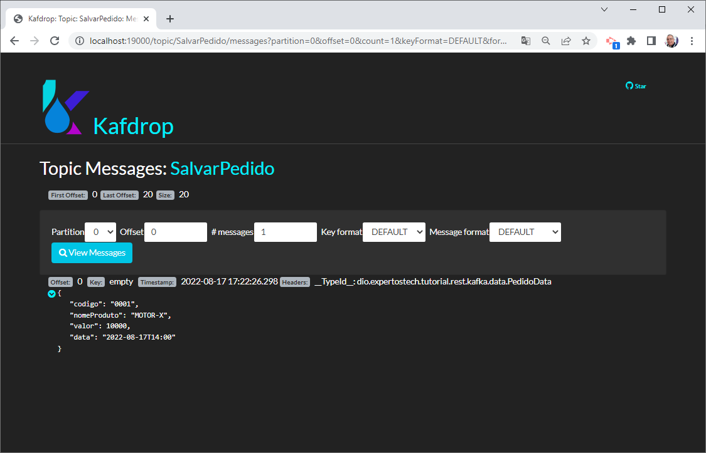
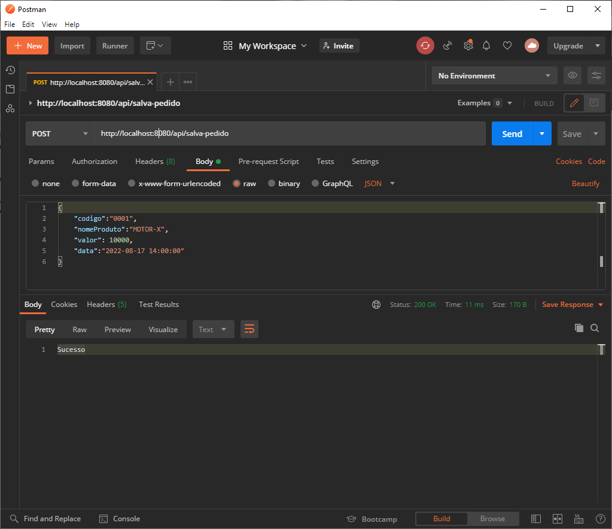

# Tutorial Springboot com Kafka

Tutorial do curso Arquitetura Orientada a Eventos com Java, Spring Boot e Kafka da Digital Innovation One Inc. 

https://github.com/expertos-tech/dio-tutorial-kafka

## Kafka

docker-compose up -d

##  Kafdrop

```
http://localhost:19000/
```




## Subir API 

```bash
cd tutorial-rest-kafka
mvn spring-boot:run
```

## Subir Microsserviço


```bash
cd tutorial-microsservico-kafka
mvn spring-boot:run
```

## Teste

### Postman



### Curl

```bash
curl --location --request POST 'http://localhost:8080/api/salva-pedido' \
--header 'Content-Type: application/json' \
--data-raw '{
 	"codigo":"0001",
    "nomeProduto":"MOTOR-X",
    "valor": 10000,
    "data":"2022-08-17 14:00:00"
}'
```

### Javascript

```javascript
var myHeaders = new Headers();
myHeaders.append("Content-Type", "application/json");

var raw = JSON.stringify({"codigo":"001","nomeProduto":"MOTOR-X","valor":10000,"data":"2022-08-17 14:00:00"});

var requestOptions = {
  method: 'POST',
  headers: myHeaders,
  body: raw,
  redirect: 'follow'
};

fetch("http://localhost:8080/api/salva-pedido", requestOptions)
  .then(response => response.text())
  .then(result => console.log(result))
  .catch(error => console.log('error', error));
```

## Aviso

Este repositório está sob lincença MIT.

## Contato

Lyndon Tavares (integraldominio@gmail.com)


